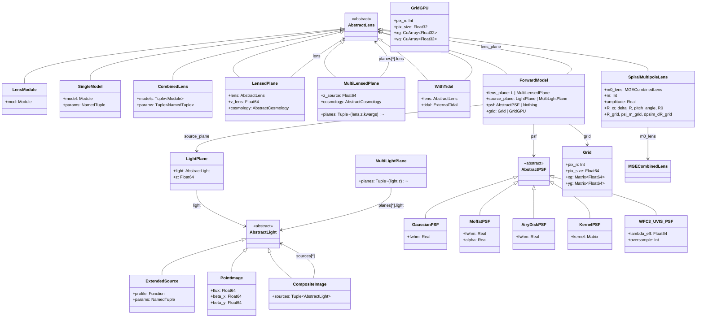
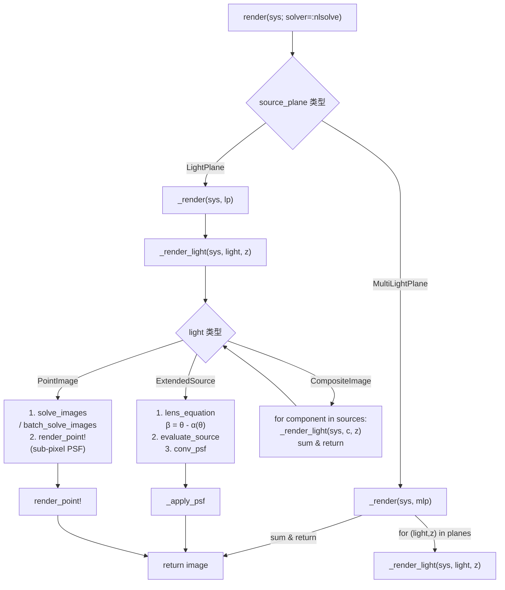

# Jens.jl LensSystem 完整架构

## render(sys) 调用链

## 类关系速查

| 层 | 质量侧 | 光度侧 | 工具侧 |
|----|--------|--------|--------|
| **抽象** | `AbstractLens` | `AbstractLight` | `AbstractPSF` |
| **原子** | `LensModule` `SingleModel` | `ExtendedSource` `PointImage` | `GaussianPSF` `MoffatPSF` `AiryDiskPSF` `KernelPSF` `WFC3_UVIS_PSF` |
| **组合** | `CombinedLens` `WithTidal` `SpiralMultipoleLens` | `CompositeImage` | — |
| **宇宙学** | `LensedPlane` `MultiLensedPlane` | `LightPlane` `MultiLightPlane` | — |
| **系统** | **ForwardModel** ← 承上启下 | | `Grid` `GridGPU` |

## ForwardModel 四字段

| 字段 | 类型 | 作用 |
|------|------|------|
| `lens_plane` | `LensedPlane` or `MultiLensedPlane` | 质量模型 + 红移 + 宇宙学 |
| `source_plane` | `LightPlane` or `MultiLightPlane` or 裸 `AbstractLight` | 光度模型 + 红移 |
| `psf` | `AbstractPSF` or `nothing` | 仪器 PSF |
| `grid` | `Grid` or `GridGPU` | 观测网格 |

## 质量模型目录

| 模型 | 模块 | 特点 |
|------|------|------|
| SIS | `SIS` | 奇异等温球，解析 Hessian ✅ |
| SIE | `SIE` | 奇异等温椭球，有限差分 Hessian |
| NIE | `NIE` | 非奇异等温椭球 |
| EPL | `EPL` | 椭球幂律，Hypergeometric 函数 |
| NFW | `NFW` | Navarro-Frenk-White 暗晕 |
| NFWE | `NFWE` | NFW + 椭率 |
| Shear | `Shear` | 外部剪切 (γ₁, γ₂) |
| PointMass | `PointMass` | 点质量 |
| Gaussian | `Gaussian` | 高斯透镜 |
| SpiralMultipole | `SpiralMultipole` | 密度波旋臂扰动 |
| **CombinedLens** | `ComLens` | 任意模型线性叠加 |
| **WithTidal** | `LensLOS` | 视向潮汐矩阵 |

## 分析工具 (LensBase)

| 函数 | 输入 | 输出 |
|------|------|------|
| `LensCriticalCurve` | `LensModel=sys` | `(ccx, ccy)` 像平面临界线 |
| `LensAdaptiveCriticalCurve` | `LensModel=sys` | `(ccx, ccy)` 自适应网格，更密 |
| `LensCaustic` | `LensModel=sys` | `(csx, csy)` 源平面焦散线 |
| `LensAdaptiveCaustic` | `LensModel=sys` | `(csx, csy)` 自适应 + 映射 |
| `LensMagnification` | `x,y; LensModel=sys` | `μ(x,y)` 放大率 |
| `LensDetJacobian` | `x,y; LensModel=sys` | `det(I-H)` |
| `LensRayShooting` | `x,y; LensModel, SourceProfile` | 光线追踪成像 |
| `lens_derivative` | `sys, x, y` | `(αx, αy)` 偏折角 |
| `lens_hessian` | `sys, x, y` | `(Hxx, Hxy, Hyy)` |
| `lens_potential` | `sys, x, y` | `ψ` 透镜势 |

## 求解器

| 函数 | 模式 | 速度 | 适用 |
|------|------|------|------|
| `solve_images(lens, bx, by)` | 串行 NLsolve + try/catch | ~50ms/源 | 精确分析 |
| `batch_solve_images(lens, bx, by)` | 批量 Newton | ~0.7ms/源 (CPU) ~0.2ms (GPU) | MCMC |

## GPU 支持

| 组件 | 状态 | 访问方式 |
|------|------|---------|
| SIS/NIS/MGE 核心 | ✅ `::Real` + `similar` + `ifelse` | 自动 |
| CombinedLens | ✅ struct-based | `ComLens.CombinedLens(...)` |
| SpiralMultipole | ✅ 参数化 `T<:Real` | 自动 |
| GridGPU | ✅ CuArray{Float32} | `GenGrid_GPU(...)` via `get_extension` |
| conv_psf GPU | ✅ cuFFT 覆盖 | `using CUDA` 后自动 |
| render_lens GPU | ✅ `import` 自动注册 | `render_lens(src, grid::GridGPU, ...)` |
| solve_images GPU | ✅ `batch_solve_images` | CPU/GPU 透明 |
| MyLens/JitLens | ❌ `zeros(Float64)` 硬编码 | 待废弃 |
| render_point! | ❌ CPU-only | 待 GPU 化 |